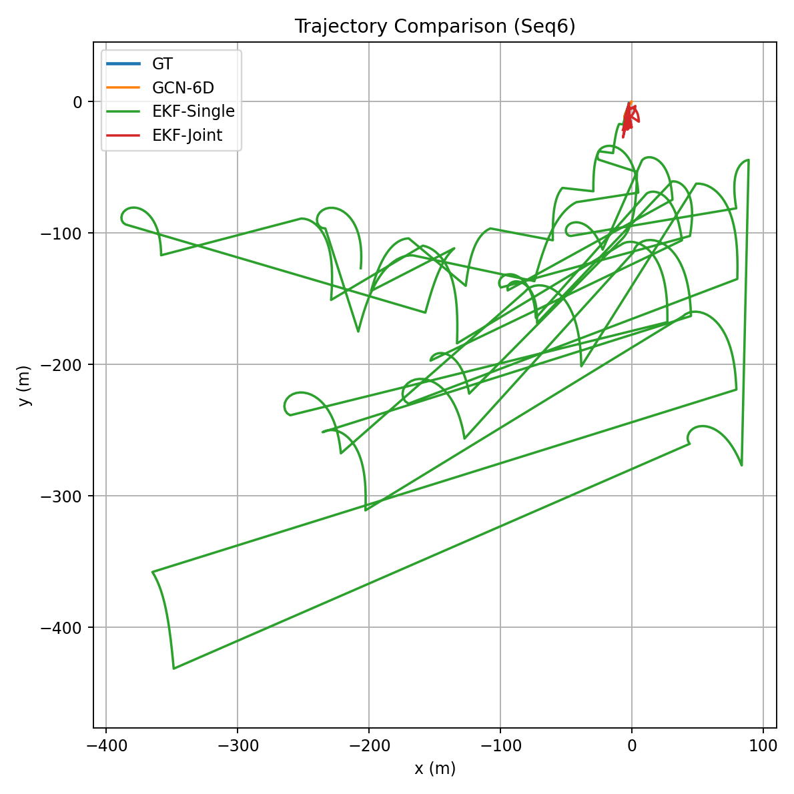
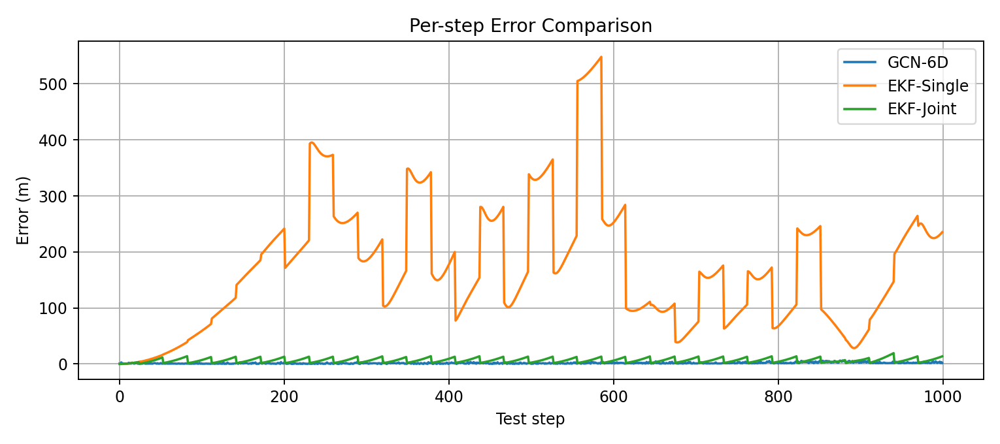
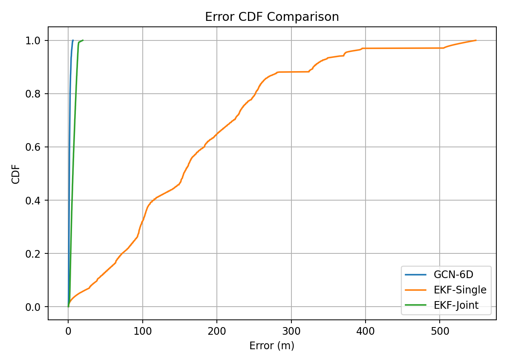
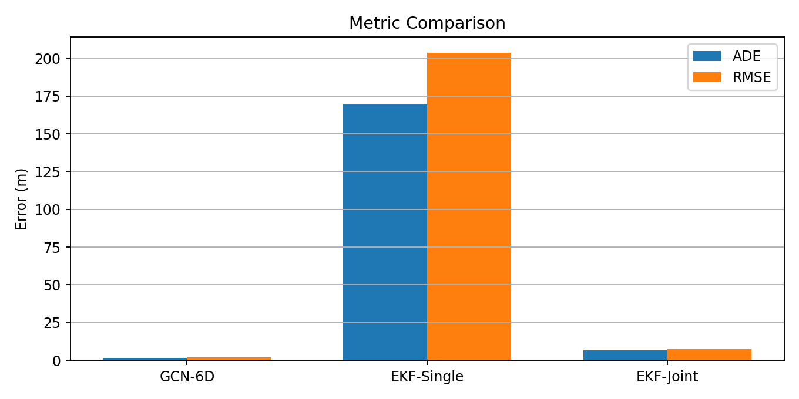

# LBL-AQUALOC Seq6: GCN 与 EKF 对比实验报告

## 1. 实验目标
在同一批数据上对比三种方法的定位效果：

1. `GCN-6D`：六元组图神经网络（`[x, y, v, a, theta, delay]`）。
2. `EKF-Single`：单锚点（`/lbl_1`）更新的 EKF。
3. `EKF-Joint`：四锚点（`/lbl_1~4`）联合更新的 EKF。

目标是评估不同方法在相同测试区间下的绝对定位误差与轨迹拟合表现。

---

## 2. 数据与处理流程

### 2.1 数据源
1. ROS1 bag：`LBL_Aqualoc_sequence_6.bag`
2. 标签轨迹：`new_archaeo_colmap_traj_sequence_06.txt`

### 2.2 统一数据切分
1. 总时间轴重采样为 5001 点。
2. 按时间顺序切分：
- 训练集：4000
- 测试集：1000

### 2.3 特征与标签
1. GCN 输入六元组：`[x, y, v, a, theta, delay]`
2. 标签：下一时刻二维位置 `[x_next, y_next]`
3. `delay` 来自 LBL `arrival_time`，缺失由 `mask` 指示。

### 2.4 EKF 建模
1. 单锚点 EKF：仅使用 `/lbl_1`。
2. 联合 EKF：同一时刻对所有可用锚点构造联合观测矩阵进行一次更新。
3. 3D 量测模型：使用斜距约束，避免 2D 模型失配。

---

## 3. 评价指标

1. `Mean error (ADE)`：平均欧氏误差（米）
2. `RMSE`：欧氏误差均方根（米）
3. `bias_x / bias_y`：坐标方向平均偏置
4. `aligned_rmse`：首点对齐后 RMSE（用于分析形状拟合与全局偏置）

---

## 4. 实验结果

| 方法 | Mean error (m) | RMSE (m) | bias_x (m) | bias_y (m) | aligned_rmse (m) |
|---|---:|---:|---:|---:|---:|
| GCN-6D | 1.6648 | 2.0412 | -0.1517 | 0.6976 | 2.3851 |
| EKF-Single | 169.2590 | 203.7482 | -77.8120 | -122.3807 | 203.6621 |
| EKF-Joint | 6.6721 | 7.5663 | -0.4587 | -6.3172 | 7.5095 |

---

## 5. 可视化结果

### 5.1 轨迹对比

### 5.2 逐步误差曲线

### 5.3 误差CDF

### 5.4 指标柱状图

---

## 6. 详细分析

### 6.1 GCN-6D 表现最好
1. GCN-6D 在绝对误差和 RMSE 上均明显优于 EKF。
2. `bias_x/bias_y` 均接近 0，说明全局偏置较小。
3. 这说明在该数据处理链路下，数据驱动方法更容易吸收异步噪声与非理想建模误差。

### 6.2 单锚点 EKF 失配严重
1. 单锚点观测约束不足，且对模型一致性要求高。
2. 在噪声、坐标系、采样差异存在时，单锚点更新难以稳定纠偏。
3. 结果呈现百米级误差，不能作为可靠基线。

### 6.3 联合 EKF 明显改善但仍落后于 GCN
1. 多锚点联合更新显著提升 EKF 可观测性。
2. RMSE 从百米级降至 10 米以内，说明联合观测是有效方向。
3. 仍落后于 GCN，表明在当前数据与参数条件下，滤波模型仍受建模偏差影响。

### 6.4 对齐误差的意义
1. 对齐后误差接近原始误差时，说明问题不只是简单全局平移。
2. EKF-Single 对齐后依旧很差，证实其动态更新过程本身不稳定。
3. EKF-Joint 对齐后变化较小，说明其误差更多来自持续偏置而非单次平移。

---

## 7. 结论

1. 在 `LBL-AQUALOC sequence_6` 与当前处理流程中，性能排序为：
- `GCN-6D` > `EKF-Joint` >> `EKF-Single`
2. 多锚点联合更新是 EKF 必要条件。
3. 当前实验下，GCN 在轨迹拟合和绝对定位上均表现最优。

---

## 8. 复现实验关键文件

1. GCN训练脚本：`train_pgt_auv_gcn6_delaymask.py`
2. EKF单锚点脚本：`ekf_seq6_baseline.py`
3. EKF联合脚本：`ekf_seq6_joint_baseline.py`
4. 对比脚本：`compare_gnn_ekf_seq6.py`
5. 对比图输出目录：`data/compare_*.png`

